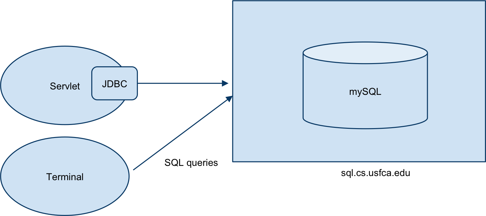

Databases and SQL
=================


## Persistent Storage ##

Basic idea: save data so that it can survive even if the machine or application reboots

- MusicLibrary gone in case of power failure
- Account information (usernames, passwords)? 
 
Options:

- Flat file - may be difficult to 
 - format
 - find information e.g., find all deposits greater than $100 in last 17 days 
 - perform concurrent writes/reads
 - not accessible across machines 

- Cloud storage
 - physically distributed (multiple sites)
 - managed by a third-party, who you may not trust!

- Relational database

"A relational database is a big spreadsheet that several people can update simultaneously." [http://philip.greenspun.com/sql/introduction.html](http://philip.greenspun.com/sql/introduction.html)

<center></center>

## SQL ##

Declarative language used to manipulate underlying data

- What should be computed, not how to compute it 
- Underlying representation of data does not matter 
 - access data that meet certain criteria
 
Common operations

- `select` - choose a row
- `join` - combine relations (tables)
- `insert`, `delete`, `update` 

## Details ##

Software - there are many Relational Database Management Systems (RDBMS) include the following:

- Oracle
- Postgres
- mySQL
- SQLite

### USF Setup
For this course, we'll be using mySQL. 

<center></center>

mySQL runs on the host `sql.cs.usfca.edu`. 

Your servlets (or any other Java program) will use Java Database Connectivity (JDBC) to connect to the database from your Java code.

### Accessing your database via command line

On a lab computer, the following command will connect to your database from a terminal.

`mysql -h sql.cs.usfca.edu -u userXX -p`

The `-h` flag indicates the host. The `-u` flag indicates the user name. _Replace the XX with your assigned id._ The `-p` indicates that a password should be requested. 

## SQL Commands ##

### General

`show databases;` - List all available databases.

`use <dbname>;` - Use a particular database. For this course, this should be userXX.

`show tables;` - After selecting a database to use, show all tables in that database. 

### Creating a table
```
mysql> create table contacts(
    -> name VARCHAR(100) not null,
    -> extension INTEGER,
    -> email VARCHAR(100) not null primary key,
    -> startdate DATE
    -> );
    Query OK, 0 rows affected (0.08 sec)

mysql> show tables; 

+------------------+
| Tables_in_user01 |
+------------------+
| contacts         |
+------------------+
1 row in set (0.00 sec)
```

Data types include the following:

- TEXT - large strings
- VARCHAR - up to 255 characters
- INTEGER
- ENUM
- DATE
- DATETIME
- BLOB 

### Basic insertion/selection

```
mysql> insert into contacts (name, extension, email, startdate) values ("Sami", 2024, "srollins", "2006-09-01");
Query OK, 1 row affected (0.00 sec)
mysql> select * from contacts;
+------+-----------+----------+------------+
| name | extension | email    | startdate  |
+------+-----------+----------+------------+
| Sami |      2024 | srollins | 2006-09-01 |
+------+-----------+----------+------------+
1 row in set (0.00 sec)
```
```
select extension, email from contacts where name="Sami";

select email from contacts where extension < 1500;
```

### Basic join

[`join`](http://www.w3schools.com/sql/sql_join.asp) allows you to combine data from multiple tables.

```
CREATE TABLE user (id INTEGER NOT NULL PRIMARY KEY, name VARCHAR(50) NOT NULL);

DESCRIBE user;

INSERT INTO user (id, name) VALUES (1, "Bob");
INSERT INTO user VALUES (2, "Sally"), (3, "Andy");

CREATE TABLE phone (id INTEGER NOT NULL, phone VARCHAR(50) NOT NULL, description VARCHAR(50) NOT NULL);

INSERT INTO phone VALUES (1, "111-111-1111", "Work"), (2, "222-222-2222", "Cell"), (6, "333-333-3333", "Home");

SELECT * FROM user, phone;

SELECT * FROM user INNER JOIN phone;

SELECT * FROM user JOIN phone;

SELECT * FROM user JOIN phone WHERE user.id=phone.id;

SELECT * FROM user NATURAL JOIN phone;

SELECT * FROM user LEFT OUTER JOIN phone ON user.id=phone.id;

SELECT * FROM user NATURAL LEFT OUTER JOIN phone;

SELECT * FROM user RIGHT OUTER JOIN phone ON user.id=phone.id;

ALTER TABLE phone CHANGE COLUMN phone phonenum VARCHAR(50);

SELECT user.name, phone.phonenum FROM user JOIN phone WHERE user.id=phone.id;


DROP TABLE user;

DROP TABLE phone;

```

### Additional Resources

- [w3schools SQL Tutorial](http://www.w3schools.com/sql/default.asp)

### Using JDBC	

JDBC allows you to connect to an SQL database from Java code.

See the code examples in the lectures repository.

### Creating an ssh tunnel

If you are off campus you will need to _tunnel_ through the firewall to access sql.cs.usfca.edu from the command line or from your Java code. 

From the terminal or putty, open an ssh connection as follows:

`ssh -L 3306:sql.cs.usfca.edu:3306 username@stargate.cs.usfca.edu`

This will route all traffic sent to your local port 3306 (the mySQL port) to port 3306 on `sql.cs.usfca.edu` via the secure connection to stargate. Make sure to _replace username with your CS login name_.
